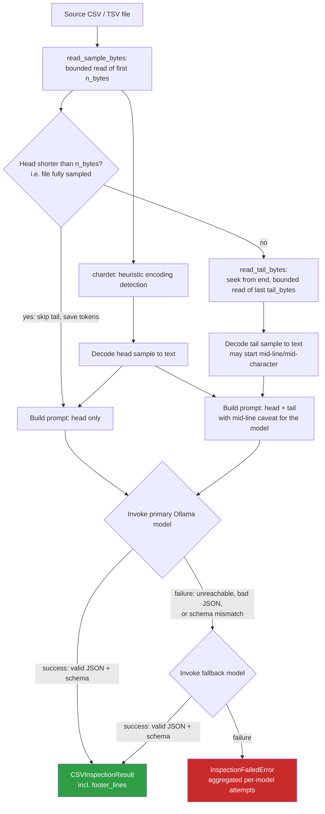

# data-agent-toolkit

Production-grade monorepo of agentic AI utilities for data engineering, built
in Python and designed to run **entirely for free, locally**, via
[Ollama](https://ollama.com), with optional cloud/API backends (e.g. Gemini)
as an opt-in.

## Design principles

1. **Local-first, dual-LLM.** Every agent defaults to a free, local Ollama
   model. Cloud/API backends are supported but never required to run the
   demo or the tests.
2. **Stateless, byte-budgeted inspection.** Agents that work on files never
   load them fully into memory; they operate on small, explicit byte
   samples, keeping cost and memory overhead close to zero even against
   multi-gigabyte sources.
3. **Structured, validated output.** Every agent returns a
   [Pydantic v2](https://docs.pydantic.dev/) model, not free text, so results
   plug directly into downstream pipelines (PySpark, BigQuery, Dataform,
   Airflow, Cloud Run, etc.).
4. **Explicit failure modes.** Each agent defines its own exception
   hierarchy rooted at a single domain base exception, instead of leaking
   bare `Exception`s to callers.
5. **Self-contained and testable.** Each agent folder ships its own
   dependencies, a synthetic data fixture, a local demo script, and can be
   exercised end-to-end without cloud credentials.

## Repository layout

```
data-agent-toolkit/
├── agents/
│   └── csv_inspector/
│       ├── inspector.py        # Core inspection pipeline (head + tail sampling)
│       ├── models.py           # Pydantic v2 schema (structured output contract)
│       ├── exceptions.py       # Domain exception hierarchy
│       ├── main_demo.py        # Local, credential-free demo/CLI
│       ├── eval_samples.py     # Manual LLM evaluation harness (not run in CI)
│       ├── sample.csv          # Original synthetic "dirty" CSV fixture
│       ├── samples/            # Catalog of 28 dialect/structural edge-case fixtures
│       │   ├── generate_samples.py  # Reproducibly (re)generates every fixture below
│       │   ├── manifest.json        # Ground truth per fixture, used by tests + eval_samples.py
│       │   └── *.csv / *.tsv        # The generated fixtures themselves
│       └── requirements.txt    # Runtime dependencies for this agent
├── common/                     # Shared utilities across agents (as they emerge)
├── tests/
│   ├── conftest.py             # Adds each agent's directory to sys.path
│   ├── test_csv_inspector.py   # Unit tests: byte sampling, prompt building, orchestration
│   └── test_samples_catalog.py # Deterministic tests parametrized over samples/ (no LLM)
├── requirements-dev.txt        # Test/dev dependencies (pytest, + runtime deps)
└── README.md
```

## Agents

### `csv_inspector`

A stateless agent that inspects only a bounded **head** window (first N
bytes) and, for files larger than that window, a bounded **tail** window
(last N bytes) of a large, potentially messy CSV/TSV file — never loading
the full file into memory, in either direction — and uses a local LLM (via
Ollama) to infer:

- Character encoding
- Field delimiter, quote character, escape rules
- Non-standard header lines (export banners, comments) *and* footer lines
  (totals rows, "end of report" markers), sourced respectively from the
  head and tail samples
- A preliminary column-level schema (name, inferred type, nullability,
  example values)

The result is returned as a Pydantic-validated `CSVInspectionResult`, ready
to drive downstream ingestion logic.

#### Pipeline



When the head sample already exhausts the file, the tail read is skipped
entirely — it would only duplicate content already visible to the model
and would waste tokens, in line with this project's cost-optimization-first
principle. When a tail sample is present, the prompt explicitly warns the
model that its first visible line is a blind byte-suffix and may be a
truncated fragment, not a real row.

#### Module layout

| File | Responsibility |
|---|---|
| `models.py` | `ColumnSchema`, `CSVInspectionResult` — the strict Pydantic v2 output contract, including `metadata_lines`/`footer_lines`. |
| `exceptions.py` | `CSVInspectorError` and its subclasses — one per domain failure mode. |
| `inspector.py` | Head/tail byte sampling (`read_sample_bytes`, `read_tail_bytes`), encoding detection, prompt construction, model invocation, JSON parsing/validation, and the primary/fallback orchestration in `inspect_csv`. |
| `main_demo.py` | CLI entry point for local, credential-free verification against `sample.csv`. |
| `eval_samples.py` | Manual evaluation harness: runs the real pipeline (Ollama required) against every fixture in `samples/` and scores it against `samples/manifest.json`. Not part of `pytest`/CI — see [Sample catalog](#sample-catalog) below. |
| `sample.csv` | Original synthetic fixture with deliberately messy characteristics: semicolon delimiter, metadata banner, accented values, embedded delimiters and escaped quotes. |
| `samples/` | Catalog of 28 further fixtures covering delimiters, encodings, header/footer variants, quoting/escaping, structural anomalies, and data-format gotchas — see below. |

The LLM backend is injected through `inspect_csv`'s `model_invoker`
parameter (default: `invoke_ollama_model`, which lazily imports the
`ollama` package). This keeps the module importable — and the pipeline
fully unit-testable — without the `ollama` package installed, and makes it
trivial to point the same pipeline at a different backend (e.g. a Gemini
API client) for the project's dual-LLM story.

#### Sample catalog

`agents/csv_inspector/samples/` holds 28 fixtures generated by
`generate_samples.py` (run it to regenerate the catalog reproducibly), each
documented with its ground truth in `manifest.json`:

| Category | Covers |
|---|---|
| `delimiter` | Comma, semicolon, tab, pipe, and a delimiter character appearing legitimately inside a quoted field. |
| `encoding` | UTF-8 with BOM, Latin-1/cp1252 (not valid UTF-8), UTF-16LE with BOM (classic old-Excel export). |
| `header_footer` | Metadata banners before the header, no header at all, a duplicated header mid-file, footer totals rows, an "end of report" marker, and both header and footer combined. |
| `quoting` | Doubled (`""`) and backslash-escaped quotes, an embedded real newline inside a quoted field (flagged `known_limitation`), inconsistent quoting, and a trailing empty field. |
| `structural` | Ragged rows, mixed CRLF/LF line endings, no trailing newline at EOF, blank lines between rows, an empty (0-byte) file, and a header-only file with zero data rows. |
| `data_format` | European decimal-comma numeric formatting, mixed null representations (`NULL`, `N/A`, `-`, `NaN`, empty), and whitespace-padded fields. |

Fixtures marked `known_limitation: true` in the manifest (currently just
the embedded-newline case) document a real limit of byte-window sampling —
a quoted multi-line record can be cut mid-record by a head/tail window —
rather than a bug this iteration is expected to fix silently.

Two different test layers consume this catalog:

- `tests/test_samples_catalog.py` (pytest, CI-safe, no LLM): validates the
  byte-sampling/encoding-detection layer and manifest/filesystem
  consistency against every fixture.
- `eval_samples.py` (manual, requires Ollama): runs the real LLM pipeline
  against every fixture and reports a per-file and aggregate accuracy
  score — see [Usage](#usage) below.

#### Usage

```bash
# 1. Create and activate a virtual environment
python -m venv .venv
.venv\Scripts\activate        # Windows
# source .venv/bin/activate   # macOS/Linux

# 2. Install runtime dependencies
pip install -r agents/csv_inspector/requirements.txt

# 3. Make sure Ollama is running locally with the target model pulled
ollama serve
ollama pull qwen2.5-coder:7b

# 4. Run the demo against the bundled sample.csv
python agents/csv_inspector/main_demo.py

# Or against your own file, with a different model, custom head/tail
# sample sizes, and verbose logging
python agents/csv_inspector/main_demo.py --file path/to/file.csv --model qwen2.5-coder:7b --bytes 8192 --tail-bytes 8192 --log-level DEBUG

# 5. (Optional) Score the model against the full 28-fixture sample catalog
python agents/csv_inspector/eval_samples.py --model qwen2.5-coder:7b
```

#### Error handling

All domain failures raise a subclass of `CSVInspectorError`
(`agents/csv_inspector/exceptions.py`):

| Exception | Raised when |
|---|---|
| `FileSampleReadError` | The source file cannot be read from disk. |
| `ModelInvocationError` | The backend is unreachable, the `ollama` package is missing, or the model is not pulled locally. |
| `ResponseParsingError` | The model's response is not valid JSON. |
| `SchemaValidationError` | The parsed JSON does not satisfy the `CSVInspectionResult` schema. |
| `InspectionFailedError` | Every configured model (primary + fallback) failed; carries an `attempts` mapping of model name → exception for diagnostics. |

## Testing

Tests live at the repository root under `tests/`, mirrored per agent
(`tests/test_<agent_name>.py`). Two layers make up the `csv_inspector`
suite, both CI-safe and free of any Ollama dependency:

- `test_csv_inspector.py` uses dependency injection (`model_invoker`) to
  exercise the full pipeline — including the primary/fallback path and
  every domain error branch — **without** requiring a running Ollama
  instance or network access. It also proves, via an `open()` spy, that
  `read_sample_bytes`/`read_tail_bytes` never fall back to a whole-file
  read regardless of source file size.
- `test_samples_catalog.py` runs the byte-sampling/encoding-detection layer
  against every fixture in `agents/csv_inspector/samples/` and checks the
  manifest stays consistent with the files on disk.

```bash
pip install -r requirements-dev.txt
pytest
```

The one piece intentionally **not** covered by `pytest` is the LLM's
inferred accuracy itself — that is non-deterministic and lives in
`eval_samples.py` (see [Sample catalog](#sample-catalog)), run manually
against a live Ollama instance.

## Code standards

- 100% English source code, comments, and docstrings.
- [Google-style docstrings](https://google.github.io/styleguide/pyguide.html#38-comments-and-docstrings)
  on every public module, class, and function: arguments, return values, and
  raised exceptions are documented explicitly.
- Full static type hints (`typing` / PEP 604 union syntax) on all functions
  and classes — PEP 8, PEP 257, and PEP 484 compliant, formatted to `ruff` /
  `black` conventions.
- `logging` module only in library and CLI code — no `print()` outside of
  the final structured result printed by `main_demo.py`.
- Explicit, typed, domain-specific exception hierarchies instead of bare
  `Exception` handling.
- Structured, Pydantic-validated output for every agent, designed for
  direct consumption by downstream pipelines.

## Adding a new agent

1. Create `agents/<agent_name>/` with its own `requirements.txt`,
   `models.py`, `exceptions.py`, core module(s), and `main_demo.py`.
2. Default to local, free execution via Ollama; make cloud/API backends
   opt-in through a pluggable interface (see `model_invoker` in
   `csv_inspector` for the pattern).
3. Return Pydantic-validated structured output — never free text.
4. Add `tests/test_<agent_name>.py`, injecting fakes for any external
   backend so the suite runs without credentials or network access.
5. Update this README's agent table and, if the pipeline is non-trivial,
   add a Mermaid diagram.
