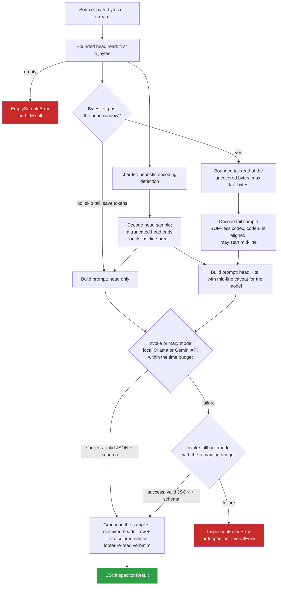

# csv-inspector

LLM-assisted inspection of large, messy CSV/TSV sources. From small,
**bounded head and tail samples**, and never loading the source in full,
`csv-inspector` infers:

- the character encoding;
- the field delimiter, quote character and escape rules;
- whether the file has a header row at all (`has_header`), where it is
  (`header_row_index`, the number of preamble lines such as export banners
  or comments to skip; `None` for a header-less file) and the footer lines
  after the data (`footer_lines`: totals rows, "end of report" markers,
  generation timestamps, blank separators; `footer_rows_to_skip` is derived
  from them);
- the column names, as written in the header row (`columns`).

Column types are not inferred: the engine that loads the file reads all of
it and infers them better than a 4 KB sample can (see
[Using the result](https://github.com/deluispablo/data-agent-toolkit/blob/main/agents/csv_inspector/docs/using-the-result.md#column-types)).

It runs on a **local Ollama model by default** (free, no credentials) or on
**Google Gemini** as an opt-in, and returns a Pydantic-validated
`CSVInspectionResult` ready to drive downstream ingestion.

It is a **library you embed** in your own application or API (FastAPI,
Flask, Django, a worker, any cloud), with a small CLI on the side. It is not
a service.

- **Embedding guide:** [docs/embedding.md](https://github.com/deluispablo/data-agent-toolkit/blob/main/agents/csv_inspector/docs/embedding.md)
  (sync and async endpoints, settings injection, timeouts, thread-safety)
- **Using the result:** [docs/using-the-result.md](https://github.com/deluispablo/data-agent-toolkit/blob/main/agents/csv_inspector/docs/using-the-result.md)
  (reader options for `csv`, pandas and PySpark; `header_row_index` is a
  physical line count, so use `skiprows`, not `header`)
- **Changelog:** [CHANGELOG.md](https://github.com/deluispablo/data-agent-toolkit/blob/main/agents/csv_inspector/CHANGELOG.md)

## Install

```bash
# From a clone of the repository
pip install ./agents/csv_inspector            # local backend (Ollama)
pip install "./agents/csv_inspector[cloud]"   # + Gemini backend

# As a dependency of another project, pinned to a release tag
pip install "csv-inspector @ git+https://github.com/deluispablo/data-agent-toolkit@csv-inspector-v0.3.0#subdirectory=agents/csv_inspector"
```

Requires Python 3.10+. The local backend needs a running
[Ollama](https://ollama.com) with the models pulled:
`ollama pull qwen2.5-coder:7b` (primary) and `ollama pull qwen2.5-coder:3b`
(fallback, only used when the primary fails).

## Quickstart

```python
from csv_inspector import inspect_csv

result = inspect_csv("exports/ledger.csv")  # a path...
result = inspect_csv(uploaded_bytes)  # ...bytes already in memory...
with open("exports/ledger.csv", "rb") as f:
    result = inspect_csv(f)  # ...or a binary stream

print(result.delimiter, result.header_row_index, result.footer_rows_to_skip)
print(result.columns)  # ["Fecha", "Cliente", "Importe"]
```

To read the file with these values, follow
[docs/using-the-result.md](https://github.com/deluispablo/data-agent-toolkit/blob/main/agents/csv_inspector/docs/using-the-result.md): `header_row_index`
and `footer_rows_to_skip` count physical lines, so pandas'
`header=result.header_row_index` silently picks the wrong row.

In asyncio code, await `ainspect_csv` instead. **Never call `inspect_csv`
on the event loop**: it blocks.

```python
from csv_inspector import ainspect_csv

result = await ainspect_csv(uploaded_bytes, timeout_seconds=30)
```

## Public API

Everything importable from `csv_inspector` (its `__all__`) is the public,
stable API. Every other module and name is internal.

| Name | What it is |
|---|---|
| `inspect_csv(source, /, *, backend, settings, model, fallback_model, n_bytes, tail_bytes, timeout_seconds, model_invoker)` | Synchronous inspection |
| `ainspect_csv(...)` | The same, for asyncio (native async clients; sampling runs in a worker thread) |
| `CSVSource` | Accepted sources: `str` or `PathLike` (a path; a `str` is never CSV content), `bytes`, `bytearray` or `memoryview`, or a binary file-like object (seekable or not) |
| `CSVInspectionResult` | The validated output contract (see [The result](#the-result)). An unquoted file still reports `quotechar='"'`, which is inert when it never occurs in the file |
| `Usage` | The type of `result.usage`: what the model phase cost (see [Usage](#usage)) |
| `LLMBackend` | `LOCAL` (Ollama, default) or `API` (Gemini) |
| `Settings` | Explicit configuration; constructing it never reads the environment |
| `DEFAULT_SAMPLE_BYTES`, `DEFAULT_TAIL_BYTES`, `MAX_SAMPLE_BYTES` | Default head and tail windows (4096 bytes each) and the largest window `inspect_csv` accepts (16384 bytes; larger raises `ValueError`) |
| `ModelInvoker`, `AsyncModelInvoker` | Types of the `model_invoker` seam: `(prompt, model) -> str` and its async twin |
| `ensure_backend_ready(backend, settings=None)` | Check a backend's configuration (cloud credentials, `google-genai` installed) without a network or model call; raises `BackendConfigurationError`. The `local` backend always passes |
| `load_settings(env_file=None)` | Explicitly read `Settings` from the environment (a `.env` only if given); works on a base install |
| `CSVInspectorError` and subclasses | See [Errors](#errors) |
| `__version__` | The installed version |

### The result

| Field | Meaning |
|---|---|
| `encoding` | The character encoding, checked against the one detected from the bytes |
| `delimiter`, `quotechar`, `escapechar`, `doublequote` | The dialect, ready for `csv`, pandas, PySpark or BigQuery |
| `has_header`, `header_row_index` | Whether the file has a row of column names, and how many physical lines precede it (`None` for a header-less file) |
| `footer_lines`, `footer_rows_to_skip` | The trailing non-data lines, verbatim, and how many there are |
| `columns` | The column names as written in the header row, in file order (`column_1`, `column_2`, ... for a header-less file). Empty names (a pandas index column) and duplicate names are kept, as they are in the file |
| `confidence` | The model's self-reported confidence, from 0.0 to 1.0 |

`confidence` is a routing signal, not a guarantee: send inspections below
a threshold you choose (for example 0.7) to human review instead of loading
them automatically. The dialect, header row, column names and footer are
grounded in the sampled bytes whatever the model's confidence.

### Sources

- **Paths** are read with one bounded read per window.
- **Buffers** are sliced; only the sampled windows are copied.
- **Seekable streams** are sampled from their **current position** to their end, and that position is restored afterwards.
- **Non-seekable streams**, such as an upload body, are consumed once, keeping only a rolling tail buffer, so memory stays bounded by `n_bytes + tail_bytes` however long the stream is. Reaching the tail means reading everything before it, so at most 64 MiB are read past the head: a longer stream gets no tail sample, and is treated like `tail_bytes=0` (no footer is reported). To sample the end of a longer stream, spool it to a temporary file and pass that. A stalled stream still blocks in `read()`, which the library cannot interrupt, so set a read timeout on the stream itself.
- **Text-mode streams** are rejected with `TypeError`; open files with `"rb"`.
- **Non-blocking streams** must have their data available: a `read()` that returns `None` (no data yet) raises `FileSampleReadError` instead of being taken as the end of the stream.

### Timeouts

`timeout_seconds` is **one overall budget for the model phase**, shared by
the primary and fallback models, so the worst case really is
`timeout_seconds`. With a fallback, the primary may use about 70 % of the
budget and the fallback gets everything left, so a slowly loading primary
(a cold 7B model on CPU) usually still answers, while a hung one leaves the
fallback about 30 %; time the primary does not use carries over. A model
the budget leaves out is logged at INFO, to help tune `timeout_seconds`. The library enforces it, so custom invokers are bounded too, and
also passes each model's share to the HTTP clients. When it runs out,
`InspectionTimeoutError` is raised (for example, map it to HTTP 504).

### Usage

Every result returned by `inspect_csv` or `ainspect_csv` carries
`result.usage`: what the model phase cost.

| Field | Meaning |
|---|---|
| `model` | The model whose answer was kept (the fallback when the primary failed) |
| `prompt_tokens`, `completion_tokens` | Summed over every model attempt, since a failed primary still costs tokens. `None` when no attempt reported them (a custom `model_invoker` returns text only) |
| `latency_seconds` | Wall time of the model phase, all attempts included |
| `attempts` | How many models were called |
| `retries` | Transient cloud errors (429/503) retried within an attempt |
| `load_seconds` | Time Ollama spent loading the model, or `None` (cloud, custom invoker) |
| `prompt_version` | The version of the prompt the models were sent (for example `2026.09-b`); it changes with every change to the prompt wording |

An attempt that fails without an answer (timeout, transport error, empty
reply) reports no tokens. `usage` is not part of the JSON contract: it is
left out of `model_dump()`, `model_dump_json()` and `model_json_schema()`.
It does take part in `==`, so compare two results' `model_dump()` to
ignore it. The library logs it in one INFO line per success.

## How it works



- **The tail never overlaps the head.** It covers at most the bytes the head
  did not read, and is skipped when the head exhausts the source; sending
  the same bytes twice would only waste tokens.
- **UTF-16/UTF-32 tails** are aligned to the code unit and decoded with the
  byte order taken from the head's BOM.
- **Byte budgets are validated up front** (`n_bytes >= 1`, `tail_bytes >= 0`):
  a negative `read()` size means "read everything", which this library
  promises never to do. Each window is also capped at 16 KiB so the prompt
  fits a local model's context window.
- **The Ollama context window is sized to the prompt** (`num_ctx`): Ollama's
  small default would otherwise silently drop the start of a long prompt,
  the instructions and head sample included.
- **The JSON answer is extracted leniently**: from a markdown code fence
  when there is one, otherwise from the first `{` to the last `}`, so
  prose around the object (`Here is the result: {...}`) does not waste an
  attempt.

**Grounding.** Small local models reliably *recognize* headers and footers
but count and copy lines poorly, so the model's answer is used as a key to
recompute the delimiter, the header row and literal column names (or "no
header"), and the verbatim footer from the sampled text. The exact rules
are in [How the result is grounded](https://github.com/deluispablo/data-agent-toolkit/blob/main/agents/csv_inspector/docs/using-the-result.md#how-the-result-is-grounded).

### Known limitations

- **The prompt's sample markers are plain text.** A file containing a line
  such as `--- HEAD SAMPLE END ---`, or text that mimics the instructions,
  can confuse the model. Grounding bounds the damage: positions, verbatim
  text, delimiter and encoding are recomputed from the real bytes. Random
  markers or escaping are not used, because they would cost prompt tokens
  on every call.
- **A forward-only stream is read at most 64 MiB past its head** to reach
  its tail. A longer stream is inspected without a tail, so no footer is
  reported (`covers_whole_file=False`; see the `Samples` docstring in
  [`_sampling.py`](https://github.com/deluispablo/data-agent-toolkit/blob/main/agents/csv_inspector/src/csv_inspector/_sampling.py)). Paths, buffers and seekable streams always
  read just the two windows.
- **A header-less file with preamble lines** is not described:
  `has_header=False` implies no lines to skip.

## Backends

| Backend | Model service | Needs | Default |
|---|---|---|---|
| `local` | Ollama | `pip install csv-inspector` + a running Ollama | ✅ |
| `api` | Google Gemini: Gemini Developer API (API key) or Vertex AI (Application Default Credentials), via `google-genai` | `pip install "csv-inspector[cloud]"` + credentials | opt-in |

Verified against the real Gemini Developer API on 2026-09-24 with
`google-genai` 2.25.0. Vertex AI has not been verified against the real
service yet ([#92](https://github.com/deluispablo/data-agent-toolkit/issues/92)).
Gemini answers `503 UNAVAILABLE` (high demand) or `429 RESOURCE_EXHAUSTED`
(free-tier quota) often. The `api` backend retries such an answer **once**,
on the same model: after the `Retry-After` header when it asks for 10 s or
less, else after about one second, and only when the retry still fits the
model's time budget. A longer `Retry-After` (a quota, not a blip), a second
failure, or any other error goes to the fallback model. The retry costs the
same tokens as the first request; it avoids discarding the primary model's
answer for a transient error. The local backend never retries.

Both backends send the same prompt: JSON output (constrained by
`CSVInspectionResult`'s JSON Schema on Gemini) at `temperature=0.0`, then
the same validation and grounding. SDKs are imported lazily; the local
backend never loads the cloud SDK.

## Settings

There are two ways to configure the library:

1. **Explicit injection**, recommended for hosts: `inspect_csv(..., settings=Settings(...))`.
   The environment is **never** read, so this is safe for multi-tenant and
   test isolation. It works on a base install.
2. **From the environment**, standalone: when `settings` is omitted, the
   library reads the environment variables below, **never a `.env` file**.
   `load_settings(env_file=...)` reads a `.env` file only when you ask it to.
   Both work on a base install. A `.env` file holds `KEY=VALUE` lines, with
   `#` comment lines, an optional `export` prefix, single or double quotes,
   and a ` # comment` after a bare value; there is no variable
   interpolation and no multi-line value.

| `Settings` field | Environment variable | Default |
|---|---|---|
| `llm_backend` | `LLM_BACKEND` (`local` / `api`) | `local` |
| `ollama_model` / `ollama_fallback_model` | `OLLAMA_MODEL` / `OLLAMA_FALLBACK_MODEL` | `qwen2.5-coder:7b` / `qwen2.5-coder:3b` |
| `ollama_host` | `OLLAMA_HOST` (the Ollama SDK's own variable) | unset: SDK default, `http://localhost:11434` |
| `gemini_api_key` | `GEMINI_API_KEY` (takes precedence when set) | unset |
| `google_cloud_project` / `google_cloud_location` | `GOOGLE_CLOUD_PROJECT` / `GOOGLE_CLOUD_LOCATION` (Vertex AI with ADC) | unset |
| `cloud_model` / `cloud_fallback_model` | `CLOUD_MODEL` / `CLOUD_FALLBACK_MODEL` | `gemini-3.6-flash` / `gemini-flash-lite-latest` |

Each fallback is a different model from its primary, so a failing primary
is retried with another model out of the box. Setting the fallback equal to
the primary turns the fallback off: only one attempt is made.

The `api` backend needs **either** an API key **or** both project and
location. A missing credential, package or invalid setting fails fast with
`BackendConfigurationError` (or its subclass `CredentialsNotConfiguredError`)
**before the source is read**, and is never retried with the fallback
model. The API key is a `SecretStr`, scrubbed from every backend error; it
never appears in logs or exceptions.

## CLI

```bash
csv-inspector data.csv                                   # or: python -m csv_inspector data.csv
csv-inspector data.csv --model qwen2.5-coder:7b --fallback-model qwen2.5-coder:3b
csv-inspector data.csv --bytes 8192 --tail-bytes 8192 --timeout 60
csv-inspector data.csv --stats                           # usage as JSON on stderr
csv-inspector data.csv --backend api --model gemini-3.6-flash --env-file secrets.env
```

As an application, the CLI reads `./.env` when it exists (`--env-file PATH`
to choose another file, `--no-env-file` to disable it); environment
variables always win. It prints the result as JSON on stdout, logs on
stderr, and on an expected failure prints a one-line error and exits with
code 1. `--stats` also prints the [usage](#usage) to stderr as JSON, after
the result, so stdout stays the result alone.

`--model` and `--fallback-model` override the backend's configured model
pair. Unlike the library, the CLI has a default time budget of 300 seconds
for the model phase, enough for a cold 7B load on CPU, so a stalled Ollama
ends in an `InspectionTimeoutError` message instead of a hang. `--timeout N`
changes the budget and `--timeout 0` removes it.

## Errors

All domain failures subclass `CSVInspectorError`:

| Exception | Raised when |
|---|---|
| `FileSampleReadError` | The source cannot be read. |
| `EmptySampleError` | The source is empty; raised before any model call. |
| `ModelInvocationError` | A model call failed: unreachable, rejected, model not available, or an empty answer. |
| `ModelTimeoutError` | A single model call timed out (subclass of `ModelInvocationError`). |
| `BackendConfigurationError` | The backend is unusable as configured: a missing SDK or extra, or an invalid setting. Raised before the source is read, never retried. |
| `CredentialsNotConfiguredError` | The `api` backend has no usable credentials; the message names what to set. |
| `ResponseParsingError` | The model's answer is not valid JSON. |
| `SchemaValidationError` | The JSON does not satisfy `CSVInspectionResult`. |
| `InspectionFailedError` | Every model failed; `.attempts` maps model name to its error. |
| `InspectionTimeoutError` | `timeout_seconds` ran out (subclass of `InspectionFailedError`). |

Invalid arguments are programming errors, not domain failures:
`ValueError` for a byte budget or timeout out of range, `TypeError` for an
unsupported source or a text-mode stream.

## Development

The package lives in the
[data-agent-toolkit](https://github.com/deluispablo/data-agent-toolkit)
monorepo, next to its tests (`tests/`), fixture catalog (`samples/`),
evaluation harness (`scripts/eval_samples.py`), demo (`main_demo.py`) and a
settings template for the CLIs (`.env.example`). See the repository's
[CONTRIBUTING.md](https://github.com/deluispablo/data-agent-toolkit/blob/main/CONTRIBUTING.md)
for the development setup.

To measure accuracy, cost and latency against the fixture catalog, and to
compare models or prompt versions, see
[docs/evaluation.md](https://github.com/deluispablo/data-agent-toolkit/blob/main/agents/csv_inspector/docs/evaluation.md).

## License

MIT
