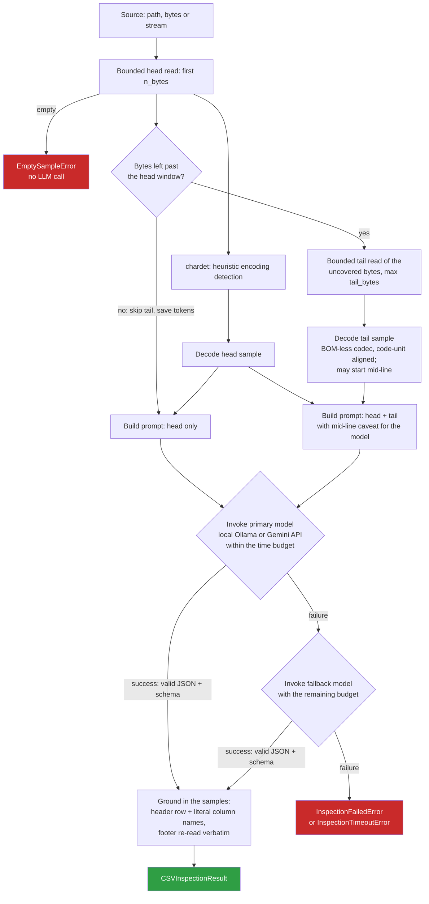

# csv-inspector

LLM-assisted inspection of large, messy CSV/TSV sources. From small,
**bounded head and tail samples**, and never loading the source in full,
`csv-inspector` infers:

- the character encoding;
- the field delimiter, quote character and escape rules;
- where the real header row is (`header_row_index`, the number of preamble
  lines such as export banners or comments to skip) and the footer lines
  after the data (`footer_lines`: totals rows, "end of report" markers,
  generation timestamps, blank separators; `footer_rows_to_skip` is derived
  from them);
- a preliminary column schema (name, inferred type, nullability, examples).

It runs on a **local Ollama model by default** (free, no credentials) or on
**Google Gemini** as an opt-in, and returns a Pydantic-validated
`CSVInspectionResult` ready to drive downstream ingestion.

It is a **library you embed** in your own application or API (FastAPI,
Flask, Django, a worker, any cloud), with a small CLI on the side. It is not
a service.

- **Embedding guide:** [docs/embedding.md](https://github.com/deluispablo/data-agent-toolkit/blob/main/agents/csv_inspector/docs/embedding.md)
  (sync and async endpoints, settings injection, timeouts, thread-safety)
- **Changelog:** [CHANGELOG.md](https://github.com/deluispablo/data-agent-toolkit/blob/main/agents/csv_inspector/CHANGELOG.md)

## Install

```bash
# From a clone of the repository
pip install ./agents/csv_inspector            # local backend (Ollama)
pip install "./agents/csv_inspector[cloud]"   # + Gemini backend and load_settings()

# As a dependency of another project, pinned to a release tag
pip install "csv-inspector @ git+https://github.com/deluispablo/data-agent-toolkit@csv-inspector-v0.1.0#subdirectory=agents/csv_inspector"
```

Requires Python 3.10+. The local backend needs a running
[Ollama](https://ollama.com) with the models pulled:
`ollama pull qwen2.5-coder:7b` (primary) and `ollama pull qwen2.5-coder:3b`
(fallback, only used when the primary fails).

## Quickstart

```python
from csv_inspector import inspect_csv

result = inspect_csv("exports/ledger.csv")  # a path...
result = inspect_csv(uploaded_bytes)  # ...bytes already in memory...
with open("exports/ledger.csv", "rb") as f:
    result = inspect_csv(f)  # ...or a binary stream

print(result.delimiter, result.header_row_index, result.footer_rows_to_skip)
print([column.name for column in result.columns])
```

In asyncio code, await `ainspect_csv` instead. **Never call `inspect_csv`
on the event loop**: it blocks.

```python
from csv_inspector import ainspect_csv

result = await ainspect_csv(uploaded_bytes, timeout_seconds=30)
```

## Public API

Everything importable from `csv_inspector` (its `__all__`) is the public,
stable API. Every other module and name is internal.

| Name | What it is |
|---|---|
| `inspect_csv(source, /, *, backend, settings, model, fallback_model, n_bytes, tail_bytes, timeout_seconds, model_invoker)` | Synchronous inspection |
| `ainspect_csv(...)` | The same, for asyncio (native async clients; sampling runs in a worker thread) |
| `CSVSource` | Accepted sources: `str` or `PathLike` (a path; a `str` is never CSV content), `bytes`, `bytearray` or `memoryview`, or a binary file-like object (seekable or not) |
| `CSVInspectionResult`, `ColumnSchema` | The validated output contract |
| `LLMBackend` | `LOCAL` (Ollama, default) or `API` (Gemini) |
| `Settings` | Explicit configuration; constructing it never reads the environment |
| `load_settings(env_file=None)` | Explicitly read `Settings` from the environment (a `.env` only if given); needs `[cloud]` |
| `CSVInspectorError` and subclasses | See [Errors](#errors) |
| `__version__` | The installed version |

### Sources

- **Paths** are read with one bounded read per window.
- **Buffers** are sliced; only the sampled windows are copied.
- **Seekable streams** are sampled from their **current position** to their end, and that position is restored afterwards.
- **Non-seekable streams**, such as an upload body, are consumed once, keeping only a rolling tail buffer, so memory stays bounded by `n_bytes + tail_bytes` however long the stream is. Reaching the tail means reading everything before it, so at most 64 MiB are read past the head: a longer stream gets no tail sample, and is treated like `tail_bytes=0` (no footer is reported). To sample the end of a longer stream, spool it to a temporary file and pass that. A stalled stream still blocks in `read()`, which the library cannot interrupt, so set a read timeout on the stream itself.
- **Text-mode streams** are rejected with `TypeError`; open files with `"rb"`.
- **Non-blocking streams** must have their data available: a `read()` that returns `None` (no data yet) raises `FileSampleReadError` instead of being taken as the end of the stream.

### Timeouts

`timeout_seconds` is **one overall budget for the model phase**, shared by
the primary and fallback models, so the worst case really is
`timeout_seconds`. Each model may use an equal share of what is left (half
for the primary when there is a fallback), so a hung or slowly loading
primary still leaves the fallback time; time a model does not use carries
over. The library enforces it, so custom invokers are bounded too, and
also passes each model's share to the HTTP clients. When it runs out,
`InspectionTimeoutError` is raised (for example, map it to HTTP 504).

## How it works



- **The tail never overlaps the head.** It covers at most the bytes the head
  did not read, and is skipped when the head exhausts the source; sending
  the same bytes twice would only waste tokens.
- **UTF-16/UTF-32 tails** are aligned to the code unit and decoded with the
  byte order taken from the head's BOM.
- **Byte budgets are validated up front** (`n_bytes >= 1`, `tail_bytes >= 0`):
  a negative `read()` size means "read everything", which this library
  promises never to do. Each window is also capped at 16 KiB so the prompt
  fits a local model's context window.
- **The Ollama context window is sized to the prompt** (`num_ctx`): Ollama's
  small default would otherwise silently drop the start of a long prompt,
  the instructions and head sample included.
- **The JSON answer is extracted leniently**: from a markdown code fence
  when there is one, otherwise from the first `{` to the last `}`, so
  prose around the object (`Here is the result: {...}`) does not waste an
  attempt.

**Grounding.** Small local models reliably *recognize* headers and footers
but count and copy lines poorly: they miscount preamble lines, paraphrase
column names ("Importe" as "Monto"), and drop blank lines or skip a footer
line. The model's answer is therefore used as a key to recompute positions
deterministically from the sampled text:

- **Header:** the head line whose fields equal the inferred column names;
  failing that, the first line with as many fields as inferred columns,
  followed by a line of the same shape, that shares at least one name with
  the model's answer. Its index becomes `header_row_index`, and its fields
  replace any paraphrased column names.
- **Footer:** the earliest reported footer line (by last occurrence) that
  really appears at the end of the source, taken verbatim through to the
  end, and extended backwards over blank separators and totals-labelled rows
  (`TOTAL`, `Subtotal`, `Total registros: 250`, `Suma`...).

Whatever cannot be anchored is returned as the model reported it. Grounding
never promotes an unlabelled data row to a footer.

## Backends

| Backend | Model service | Needs | Default |
|---|---|---|---|
| `local` | Ollama | `pip install csv-inspector` + a running Ollama | ✅ |
| `api` | Google Gemini: Gemini Developer API (API key) or Vertex AI (Application Default Credentials), via `google-genai` | `pip install "csv-inspector[cloud]"` + credentials | opt-in |

> [!WARNING]
> **The `api` backend is implemented and unit-tested against a mocked
> client, but has not yet been verified against the real service**: no
> credentials were available when it was built. Tracked in
> [#5](https://github.com/deluispablo/data-agent-toolkit/issues/5).

Both backends send the same prompt: JSON output (constrained by
`CSVInspectionResult`'s JSON Schema on Gemini) at `temperature=0.0`, then
the same validation and grounding. SDKs are imported lazily; the local
backend never loads the cloud SDK.

## Settings

There are two ways to configure the library:

1. **Explicit injection**, recommended for hosts: `inspect_csv(..., settings=Settings(...))`.
   The environment is **never** read, so this is safe for multi-tenant and
   test isolation. It works on a base install.
2. **From the environment**, standalone: when `settings` is omitted, the
   library reads the environment variables below, **never a `.env` file**.
   `load_settings(env_file=...)` reads a `.env` file only when you ask it to.
   Reading the environment needs the `[cloud]` extra; without it, the local
   backend uses built-in defaults.

| `Settings` field | Environment variable | Default |
|---|---|---|
| `llm_backend` | `LLM_BACKEND` (`local` / `api`) | `local` |
| `ollama_model` / `ollama_fallback_model` | `OLLAMA_MODEL` / `OLLAMA_FALLBACK_MODEL` | `qwen2.5-coder:7b` / `qwen2.5-coder:3b` |
| `gemini_api_key` | `GEMINI_API_KEY` (takes precedence when set) | unset |
| `google_cloud_project` / `google_cloud_location` | `GOOGLE_CLOUD_PROJECT` / `GOOGLE_CLOUD_LOCATION` (Vertex AI with ADC) | unset |
| `cloud_model` / `cloud_fallback_model` | `CLOUD_MODEL` / `CLOUD_FALLBACK_MODEL` | `gemini-2.5-flash` / `gemini-2.5-flash-lite` |

Each fallback is a different model from its primary, so a failing primary
is retried with another model out of the box. Setting the fallback equal to
the primary turns the fallback off: only one attempt is made.

The `api` backend needs **either** an API key **or** both project and
location. A missing credential, package or invalid setting fails fast with
`BackendConfigurationError` (or its subclass `CredentialsNotConfiguredError`)
**before the source is read**, and is never retried with the fallback
model. The API key is a `SecretStr`, scrubbed from every backend error; it
never appears in logs or exceptions.

## CLI

```bash
csv-inspector data.csv                                   # or: python -m csv_inspector data.csv
csv-inspector data.csv --model qwen2.5-coder:7b --bytes 8192 --tail-bytes 8192 --timeout 60
csv-inspector data.csv --backend api --model gemini-2.5-flash --env-file secrets.env
```

As an application, the CLI reads `./.env` when it exists (`--env-file PATH`
to choose another file, `--no-env-file` to disable it); environment
variables always win. It prints the result as JSON on stdout, logs on
stderr, and on an expected failure prints a one-line error and exits with
code 1.

## Errors

All domain failures subclass `CSVInspectorError`:

| Exception | Raised when |
|---|---|
| `FileSampleReadError` | The source cannot be read. |
| `EmptySampleError` | The source is empty; raised before any model call. |
| `ModelInvocationError` | A model call failed: unreachable, rejected, model not available, or an empty answer. |
| `ModelTimeoutError` | A single model call timed out (subclass of `ModelInvocationError`). |
| `BackendConfigurationError` | The backend is unusable as configured: a missing SDK or extra, or an invalid setting. Raised before the source is read, never retried. |
| `CredentialsNotConfiguredError` | The `api` backend has no usable credentials; the message names what to set. |
| `ResponseParsingError` | The model's answer is not valid JSON. |
| `SchemaValidationError` | The JSON does not satisfy `CSVInspectionResult`. |
| `InspectionFailedError` | Every model failed; `.attempts` maps model name to its error. |
| `InspectionTimeoutError` | `timeout_seconds` ran out (subclass of `InspectionFailedError`). |

Invalid arguments are programming errors, not domain failures:
`ValueError` for a byte budget or timeout out of range, `TypeError` for an
unsupported source or a text-mode stream.

## Development

The package lives in the
[data-agent-toolkit](https://github.com/deluispablo/data-agent-toolkit)
monorepo, next to its fixture catalog (`samples/`), the evaluation harness
(`scripts/eval_samples.py`) and the demo (`main_demo.py`); the tests live
in the repository's `tests/`. See the repository README for the
development setup.

## License

MIT
