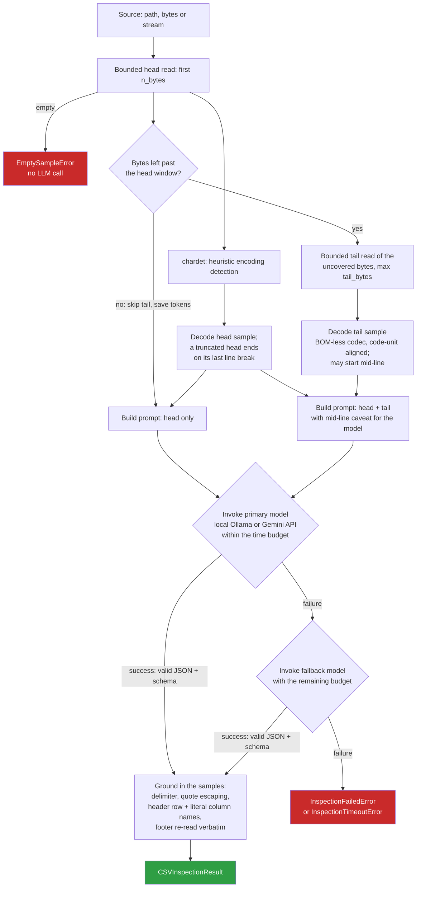

# csv-inspector

**Point it at any CSV. Get back how to read it.**


<picture>
  <source media="(prefers-color-scheme: dark)" srcset="docs/assets/hero-dark.svg">
  
</picture>

`csv-inspector` is an LLM-assisted inspector for large, messy CSV/TSV
sources. It reads **small, bounded head and tail samples**, never the whole
file, and tells you the encoding, the dialect, where the header is, which
footer lines to drop and what the columns are called. It runs on a **free,
local Ollama model by default** (no credentials) or on **Google Gemini** as
an opt-in, and returns a Pydantic-validated `CSVInspectionResult` ready to
drive downstream ingestion.

[Install](#install) · [Quickstart](#quickstart) · [How it works](#how-it-works) ·
[Embedding guide](https://github.com/deluispablo/data-agent-toolkit/blob/main/agents/csv_inspector/docs/embedding.md) ·
[Using the result](https://github.com/deluispablo/data-agent-toolkit/blob/main/agents/csv_inspector/docs/using-the-result.md) ·
[Changelog](https://github.com/deluispablo/data-agent-toolkit/blob/main/agents/csv_inspector/CHANGELOG.md)

## Why

Real-world exports are rarely the tidy CSV a reader expects. The file in the
picture above is a typical one: a report banner and a timestamp before the
header, `;` as the delimiter, decimal commas, a dash, a `€` sign and
accented city names in Windows-1252, and a totals row plus an "end of
report" marker after the data. A default `pandas.read_csv` stops at the
first byte that is not UTF-8 with a
`UnicodeDecodeError`; fix the encoding and it still needs the right
delimiter, the lines to skip at both ends and the right header row.

`csv-inspector` answers the questions you would otherwise answer by opening
the file and counting lines, for files you have never seen and may be far
too large to open:

| It infers | Reported as |
|---|---|
| The character encoding | `encoding` (a Python codec name) |
| The field delimiter, quote character and escape rules | `delimiter`, `quotechar`, `escapechar`, `doublequote` |
| Whether the file has a header row at all | `has_header` |
| Where the header is: the number of preamble lines, such as export banners or comments, to skip | `header_row_index` (`None` for a header-less file) |
| The footer lines after the data: totals rows, "end of report" markers, generation timestamps, blank separators | `footer_lines`, and `footer_rows_to_skip` derived from them |
| The column names, as written in the header row | `columns` |

Column types are not inferred: the engine that loads the file reads all of
it and infers them better than a 4 KB sample can (see
[Using the result](https://github.com/deluispablo/data-agent-toolkit/blob/main/agents/csv_inspector/docs/using-the-result.md#column-types)).

### What makes it different

- **Never loads the source.** One bounded read of the head and one of the
  tail (4 KiB each by default, 16 KiB at most), whether the file is 4 KB or
  40 GB.
- **Free and local by default.** Ollama with `qwen2.5-coder:7b`, falling
  back to `qwen2.5-coder:3b`. Gemini is an opt-in extra.
- **Grounded, not trusted.** The model's answer is re-checked against the
  real bytes: the delimiter, the quote escaping, the header row, the
  literal column names and the verbatim footer are recomputed from the
  sample.
- **A validated contract.** A small Pydantic v2 model with exactly what a
  reader needs, not free text; `confidence` tells you which files to send
  to human review.
- **Built to embed.** A library for your own application or API (FastAPI,
  Flask, Django, a worker, any cloud), with sync and async entry points,
  one time budget for the whole model phase, typed errors, and the cost of
  every call in `result.usage`. There is a small CLI on the side. It is not
  a service.

## See it run

A real session with the local backend on the two demo files from the
picture,
[`demo_sales.csv`](https://github.com/deluispablo/data-agent-toolkit/blob/main/agents/csv_inspector/docs/assets/demo_sales.csv)
(Windows-1252, `;`, a preamble, a totals row and an end marker) and
[`demo_stock.tsv`](https://github.com/deluispablo/data-agent-toolkit/blob/main/agents/csv_inspector/docs/assets/demo_stock.tsv)
(UTF-16 with a BOM, tabs, doubled quotes, a totals row and an export
stamp):


## Accuracy at a glance

<!--
  Keep this section in step with the latest published baseline in
  docs/evaluation.md. Any pull request that publishes a new baseline (see
  "Publishing a baseline" there) updates these figures in the same PR.
-->

Measured with the repository's evaluation harness against a catalog of
**80 messy fixtures** (encodings, delimiters, quoting, preambles, footers,
header-less files, structural oddities). Baseline 0.4.0, measured on
2026-09-25, next to 0.3.0:

| | Local: `qwen2.5-coder:7b` | Cloud: `gemini-flash-lite-latest` |
|---|---|---|
| Accuracy | **99.7 %** (the full catalog, 3 repeats; 0.3.0: 92.8 %) | **100 %** (a 15-fixture subset; 0.3.0: 98.1 %) |
| Latency per inspection | p50 1.6 s, p95 6.5 s (0.3.0: 5.0 s, 20.9 s) | p50 1.1 s, p95 1.4 s |
| Cost | $0, on your own machine | about $0.84 per 1,000 files at list price, on that subset (0.3.0: $1.64) |

Each fixture scores the share of its fields that match the ground truth;
accuracy is the mean over fixtures, known limitations and failed
inspections excluded. On 0.4.0 every category is at 100 % except
`header_footer` (99.2 %), and no inspection fails on the 7b model: the
40-column files that failed on 0.3.0 now pass
([#147](https://github.com/deluispablo/data-agent-toolkit/issues/147)).
The fallback `qwen2.5-coder:3b` scores 98.7 % when used as the primary. The
remaining misses are two known limitations and one missed footer. Since
[#158](https://github.com/deluispablo/data-agent-toolkit/issues/158) the
catalog scores `escapechar` and `doublequote` on every fixture with quoted
fields (45 of 80); the 0.4.0 answers, replayed, score 100 % on both.
Method, per-category and per-field scores, machine and every miss:
[docs/evaluation.md](https://github.com/deluispablo/data-agent-toolkit/blob/main/agents/csv_inspector/docs/evaluation.md#baseline-040).

## Install

```bash
# From a clone of the repository
pip install ./agents/csv_inspector            # local backend (Ollama)
pip install "./agents/csv_inspector[cloud]"   # + Gemini backend

# As a dependency of another project, pinned to a release tag
pip install "csv-inspector @ git+https://github.com/deluispablo/data-agent-toolkit@csv-inspector-v0.4.0#subdirectory=agents/csv_inspector"
```

Requires Python 3.10+. The local backend needs a running
[Ollama](https://ollama.com) with the models pulled:
`ollama pull qwen2.5-coder:7b` (primary) and `ollama pull qwen2.5-coder:3b`
(fallback, only used when the primary fails).

## Quickstart

```python
from csv_inspector import inspect_csv

result = inspect_csv("exports/ledger.csv")  # a path...
result = inspect_csv(uploaded_bytes)  # ...bytes already in memory...
with open("exports/ledger.csv", "rb") as f:
    result = inspect_csv(f)  # ...or a binary stream

print(result.delimiter, result.header_row_index, result.footer_rows_to_skip)
print(result.columns)  # ["Fecha", "Cliente", "Importe"]
```

In asyncio code, await `ainspect_csv` instead. **Never call `inspect_csv`
on the event loop**: it blocks.

```python
from csv_inspector import ainspect_csv

result = await ainspect_csv(uploaded_bytes, timeout_seconds=30)
```

### Read the file with the result

`header_row_index` and `footer_rows_to_skip` count **physical lines**, so
pandas' `header=result.header_row_index` silently picks the wrong row. Use
`skiprows`:

```python
import pandas as pd

df = pd.read_csv(
    path,
    encoding=result.encoding,
    sep=result.delimiter,
    quotechar=result.quotechar,
    escapechar=result.escapechar,
    doublequote=result.doublequote,
    skiprows=result.header_row_index or 0,  # physical lines: NOT header=
    header=0 if result.has_header else None,
    names=None if result.has_header else result.columns,
    skipfooter=result.footer_rows_to_skip,
    engine="python" if result.footer_rows_to_skip else "c",
)
```

The recipes for the stdlib `csv` module and PySpark, and the traps behind
each option, are in
[docs/using-the-result.md](https://github.com/deluispablo/data-agent-toolkit/blob/main/agents/csv_inspector/docs/using-the-result.md).

## How it works

One real inspection of the demo file, step by step. For the picture, the
windows are shrunk to 224 and 80 bytes so that a 380-byte file shows both;
the defaults are 4 KiB each.

<picture>
  <source media="(prefers-color-scheme: dark)" srcset="docs/assets/walkthrough-dark.svg">
  
</picture>

**1. Sample.** The source (a path, bytes or a stream) is read in two
bounded windows: the head and, when bytes are left past it, the tail. The
middle of the file is never read. A truncated head ends on its last line
break; the tail may start mid-line, and the model is told so.

<details>
<summary>The samples, as decoded</summary>

224 bytes of head, 80 bytes of tail, 76 bytes never read, of 380 (encoding Windows-1252).

Head:

````text
Sales report – ACME Europe Ltd.
Generated: 2026-09-24 08:15

Date;Store;Product;Units;Amount (€);Returned
2026-07-01;München;Ground coffee 1kg;12;143,40;no
2026-07-01;Zürich;Green tea;7;38,50;no
````

Tail (it may start mid-line):

````text
ançon;Ground coffee 1kg;9;107,55;no
TOTAL;;;51;427,30;
*** End of report ***
````

</details>

**2. Prompt.** Both samples go into one prompt. The answer's shape is fixed
by a JSON Schema that both backends enforce, so the prompt only explains
what the fields mean.

<details>
<summary>The exact prompt (842 tokens, prompt version 2026.09-m)</summary>

````text
Byte samples of a real, possibly messy CSV file follow. Encoding guessed by chardet (may be wrong): 'Windows-1252'.

--- HEAD SAMPLE START (first bytes of the file) ---
Sales report – ACME Europe Ltd.
Generated: 2026-09-24 08:15

Date;Store;Product;Units;Amount (€);Returned
2026-07-01;München;Ground coffee 1kg;12;143,40;no
2026-07-01;Zürich;Green tea;7;38,50;no

--- HEAD SAMPLE END ---

--- TAIL SAMPLE START (last bytes of the file; may start mid-line or mid-word) ---
ançon;Ground coffee 1kg;9;107,55;no
TOTAL;;;51;427,30;
*** End of report ***

--- TAIL SAMPLE END ---

The head stops mid-data: its last line may be cut and is never a footer. The tail is the real end of the file: read footer lines ONLY from its last lines. Its first line is likely a cut fragment: do not use it for columns.

HEADER:
- Preamble lines (export banners, '#' comments, blank lines) come before the column-name row: "header_row_index" is their count (0-based index of that row). Never list them; footer lines are never preamble.
- No column-name row (the first line is already data, e.g. "17,red,3.5"): "has_header": false, "header_row_index": null, columns column_1, column_2, ...

FOOTER (end of the file): check the last lines of the TAIL sample independently of the header. A data row holds a real record, with values like the rows above it (a date in the date column, a name in the name column, and so on). Any trailing line after the last data row is a footer line, for example:
- a totals/summary row: it may have the same number of fields as a data row, but it carries a label instead of a record and leaves other fields empty, e.g. "TOTAL,,4241.25", "TOTAL;;;98765.40" or "Total registros: 250"
- an end-of-report marker, e.g. "--- Fin del informe ---" or "*** END ***"
- a generation timestamp or signature, e.g. "Generado el 2024-01-20 10:00:00"
- a blank line separating the data from any of the above
Copy only the first non-blank line after the last data row, verbatim, into "footer_first_line"; the rest of the footer is read from the file. Use null only when the file really ends with a data row.

Analyze the samples and answer with a JSON object matching the schema you were given. What its fields mean:
- "encoding" is the real encoding, e.g. utf-8, latin-1, cp1252.
- "quotechar" is the character that wraps quoted fields: "'" when fields look like 'Acme, S.L.', '"' when they look like "Acme, S.L." or are never quoted.
- "escapechar" and "doublequote": a quote inside a quoted field written with a backslash (\") means "escapechar": "\\", "doublequote": false; written doubled ("") or never present, "escapechar": null, "doublequote": true.
- "delimiter" is the real separator: it may also appear inside quoted fields, and rows may have uneven field counts.
- "columns" holds each name copied character for character from the header row.
````

</details>

**3. Ask a model.** The primary model answers, and the fallback model if
the primary fails, within one time budget.

<details>
<summary>The model's raw answer (qwen2.5-coder:7b)</summary>

````json
{
  "encoding": "Windows-1252",
  "delimiter": ";",
  "quotechar": "\"",
  "escapechar": null,
  "doublequote": true,
  "has_header": true,
  "header_row_index": 0,
  "footer_first_line": "TOTAL;;;51;427,30;",
  "columns": [
    "Date",
    "Store",
    "Product",
    "Units",
    "Amount (€)",
    "Returned"
  ],
  "confidence": 0.95
}
````

</details>

**4. Ground.** Small local models reliably *recognize* headers and footers
but count and copy lines poorly, so the model's answer is used as a key to
recompute the delimiter, the header row and literal column names (or "no
header"), and the verbatim footer from the sampled text. How quotes are
escaped (`""`, `\"` or not at all) is read from the samples too, when they
show one convention, or quoted fields with no quote inside. Common
small-model slips are read instead of failing (a confidence of `90` as
90 %, a tab written `"tab"`, a line break answered as the delimiter of a one-column file). The exact rules are in
[How the result is grounded](https://github.com/deluispablo/data-agent-toolkit/blob/main/agents/csv_inspector/docs/using-the-result.md#how-the-result-is-grounded).

<details>
<summary>What grounding changed</summary>

| Field | Model | Result |
|---|---|---|
| `header_row_index` | `0` | `3` |
| `footer_lines` | `["TOTAL;;;51;427,30;"]` | `["TOTAL;;;51;427,30;", "*** End of report ***"]` |

</details>

**5. Validate and read.** The result is validated into a
`CSVInspectionResult`, or a typed error is raised. Read the file with it
as shown in [Read the file with the result](#read-the-file-with-the-result).

<details>
<summary>The final result</summary>

````json
{
  "encoding": "Windows-1252",
  "delimiter": ";",
  "quotechar": "\"",
  "escapechar": null,
  "doublequote": true,
  "has_header": true,
  "header_row_index": 3,
  "footer_lines": [
    "TOTAL;;;51;427,30;",
    "*** End of report ***"
  ],
  "columns": [
    "Date",
    "Store",
    "Product",
    "Units",
    "Amount (€)",
    "Returned"
  ],
  "confidence": 0.95,
  "footer_rows_to_skip": 2
}
````

</details>

<details>
<summary><b>The full pipeline, step by step</b></summary>



- **The tail never overlaps the head.** It covers at most the bytes the head
  did not read, and is skipped when the head exhausts the source; sending
  the same bytes twice would only waste tokens.
- **UTF-16/UTF-32 tails** are aligned to the code unit and decoded with the
  byte order taken from the head's BOM.
- **Byte budgets are validated up front** (`n_bytes >= 1`, `tail_bytes >= 0`):
  a negative `read()` size means "read everything", which this library
  promises never to do. Each window is also capped at 16 KiB so the prompt
  fits a local model's context window.
- **The Ollama context window is sized to the prompt** (`num_ctx`): Ollama's
  small default would otherwise silently drop the start of a long prompt,
  the instructions and head sample included.
- **The JSON answer is extracted leniently**: from a markdown code fence
  when there is one, otherwise from the first `{` to the last `}`, so
  prose around the object (`Here is the result: {...}`) does not waste an
  attempt.

</details>

### Known limitations

- **The prompt's sample markers are plain text.** A file containing a line
  such as `--- HEAD SAMPLE END ---`, or text that mimics the instructions,
  can confuse the model. Grounding bounds the damage: positions, verbatim
  text, delimiter and encoding are recomputed from the real bytes. Random
  markers or escaping are not used, because they would cost prompt tokens
  on every call.
- **A forward-only stream is read at most 64 MiB past its head** to reach
  its tail. A longer stream is inspected without a tail, so no footer is
  reported (`covers_whole_file=False`; see the `Samples` docstring in
  [`_sampling.py`](https://github.com/deluispablo/data-agent-toolkit/blob/main/agents/csv_inspector/src/csv_inspector/_sampling.py)). Paths, buffers and seekable streams always
  read just the two windows.
- **A header-less file with preamble lines** is not described:
  `has_header=False` implies no lines to skip.
- **A quoted value with a line break inside** (a multi-line record) can
  throw off the header or footer position: grounding reads the samples
  line by line.
- **A footer longer than the tail window** is only partly anchored; pass a
  larger `tail_bytes`.
- **Lines longer than the head window** (hundreds of columns) leave no
  complete header line to read; pass a larger `n_bytes`.

These are the catalog's known limitations, with their fixtures, in
[docs/evaluation.md](https://github.com/deluispablo/data-agent-toolkit/blob/main/agents/csv_inspector/docs/evaluation.md#known-limitations).

## Backends

| | `local` (default) | `api` (opt-in) |
|---|---|---|
| Model service | Ollama | Google Gemini: Gemini Developer API (API key) or Vertex AI (Application Default Credentials), via `google-genai` |
| Install | `pip install csv-inspector` + a running Ollama | `pip install "csv-inspector[cloud]"` + credentials |
| Default models | `qwen2.5-coder:7b`, fallback `qwen2.5-coder:3b` | `gemini-3.6-flash`, fallback `gemini-flash-lite-latest` |
| Cost | Free | Pay per token (free tier available) |
| Retries | Never | One retry on `503` / `429`, see below |

Both backends send the same prompt and the same JSON Schema of the
answer, at `temperature=0.0`, then run the same validation and grounding.
The schema constrains the output (Ollama's structured outputs, Gemini's
`response_json_schema`), so the prompt only explains what the fields mean.
An Ollama server older than 0.5, which rejects a schema, is asked again in
plain JSON mode, with a WARNING. SDKs are imported lazily; the local
backend never loads the cloud SDK.

**Gemini notes.** Verified against the real Gemini Developer API on
2026-09-24 with `google-genai` 2.25.0. Vertex AI has not been verified
against the real service yet
([#92](https://github.com/deluispablo/data-agent-toolkit/issues/92)).
Gemini answers `503 UNAVAILABLE` (high demand) or `429 RESOURCE_EXHAUSTED`
(free-tier quota) often. The `api` backend retries such an answer **once**,
on the same model: after the `Retry-After` header when it asks for 10 s or
less, else after about one second, and only when the retry still fits the
model's time budget. A longer `Retry-After` (a quota, not a blip), a second
failure, or any other error goes to the fallback model. The retry costs the
same tokens as the first request; it avoids discarding the primary model's
answer for a transient error. The local backend never retries.

## Documentation

- **Embedding guide:** [docs/embedding.md](https://github.com/deluispablo/data-agent-toolkit/blob/main/agents/csv_inspector/docs/embedding.md)
  (sync and async endpoints, settings injection, timeouts, thread-safety)
- **Using the result:** [docs/using-the-result.md](https://github.com/deluispablo/data-agent-toolkit/blob/main/agents/csv_inspector/docs/using-the-result.md)
  (reader options for `csv`, pandas and PySpark; `header_row_index` is a
  physical line count, so use `skiprows`, not `header`)
- **Evaluation:** [docs/evaluation.md](https://github.com/deluispablo/data-agent-toolkit/blob/main/agents/csv_inspector/docs/evaluation.md)
  (accuracy, cost and latency against the fixture catalog)
- **Changelog:** [CHANGELOG.md](https://github.com/deluispablo/data-agent-toolkit/blob/main/agents/csv_inspector/CHANGELOG.md)

## Reference

### Public API

Everything importable from `csv_inspector` (its `__all__`) is the public,
stable API. Every other module and name is internal.

| Name | What it is |
|---|---|
| `inspect_csv(source, /, *, backend, settings, model, fallback_model, n_bytes, tail_bytes, timeout_seconds, model_invoker)` | Synchronous inspection |
| `ainspect_csv(...)` | The same, for asyncio (native async clients; sampling runs in a worker thread) |
| `CSVSource` | Accepted sources: `str` or `PathLike` (a path; a `str` is never CSV content), `bytes`, `bytearray` or `memoryview`, or a binary file-like object (seekable or not) |
| `CSVInspectionResult` | The validated output contract (see [The result](#the-result)). An unquoted file still reports `quotechar='"'`, which is inert when it never occurs in the file |
| `Usage` | The type of `result.usage`: what the model phase cost (see [Usage](#usage)) |
| `LLMBackend` | `LOCAL` (Ollama, default) or `API` (Gemini) |
| `Settings` | Explicit configuration; constructing it never reads the environment |
| `DEFAULT_SAMPLE_BYTES`, `DEFAULT_TAIL_BYTES`, `MAX_SAMPLE_BYTES` | Default head and tail windows (4096 bytes each) and the largest window `inspect_csv` accepts (16384 bytes; larger raises `ValueError`) |
| `ModelInvoker`, `AsyncModelInvoker` | Types of the `model_invoker` seam: `(prompt, model) -> str` and its async twin |
| `ensure_backend_ready(backend, settings=None)` | Check a backend's configuration (cloud credentials, `google-genai` installed) without a network or model call; raises `BackendConfigurationError`. The `local` backend always passes |
| `load_settings(env_file=None)` | Explicitly read `Settings` from the environment (a `.env` only if given); works on a base install |
| `CSVInspectorError` and subclasses | See [Errors](#errors) |
| `__version__` | The installed version |

### The result

| Field | Meaning |
|---|---|
| `encoding` | The character encoding, checked against the one detected from the bytes |
| `delimiter`, `quotechar`, `escapechar`, `doublequote` | The dialect, ready for `csv`, pandas, PySpark or BigQuery |
| `has_header`, `header_row_index` | Whether the file has a row of column names, and how many physical lines precede it (`None` for a header-less file) |
| `footer_lines`, `footer_rows_to_skip` | The trailing non-data lines, verbatim, and how many there are |
| `columns` | The column names as written in the header row, in file order (`column_1`, `column_2`, ... for a header-less file). Empty names (a pandas index column) and duplicate names are kept, as they are in the file |
| `confidence` | The model's self-reported confidence, from 0.0 to 1.0 |

`confidence` is a routing signal, not a guarantee: send inspections below
a threshold you choose (for example 0.7) to human review instead of loading
them automatically. The dialect, header row, column names and footer are
grounded in the sampled bytes whatever the model's confidence.

Building or validating a `CSVInspectionResult` by hand is strict: pass the
real characters (a tab, not `"tab"`; `None`, not `""` or `"null"`) and an
explicit `has_header`. The lenient reading of small-model spellings applies
only to a model's answer, including a custom `model_invoker`'s.

### Sources

| Source | How it is read |
|---|---|
| **Paths** | One bounded read per window. |
| **Buffers** | Sliced; only the sampled windows are copied. |
| **Seekable streams** | Sampled from their **current position** to their end, and that position is restored afterwards. |
| **Non-seekable streams**, such as an upload body | Consumed once, keeping only a rolling tail buffer, so memory stays bounded by `n_bytes + tail_bytes` however long the stream is. See below. |
| **Text-mode streams** | Rejected with `TypeError`; open files with `"rb"`. |
| **Non-blocking streams** | Must have their data available: a `read()` that returns `None` (no data yet) raises `FileSampleReadError` instead of being taken as the end of the stream. |

Reaching the tail of a non-seekable stream means reading everything before
it, so at most 64 MiB are read past the head: a longer stream gets no tail
sample, and is treated like `tail_bytes=0` (no footer is reported). To
sample the end of a longer stream, spool it to a temporary file and pass
that. A stalled stream still blocks in `read()`, which the library cannot
interrupt, so set a read timeout on the stream itself.

### Timeouts

`timeout_seconds` is **one overall budget for the model phase**, shared by
the primary and fallback models, so the worst case really is
`timeout_seconds`. With a fallback, the primary may use about 70 % of the
budget and the fallback gets everything left, so a slowly loading primary
(a cold 7B model on CPU) usually still answers, while a hung one leaves the
fallback about 30 %; time the primary does not use carries over. A model
the budget leaves out is logged at INFO, to help tune `timeout_seconds`.
The library enforces it, so custom invokers are bounded too, and also
passes each model's share to the HTTP clients. When it runs out,
`InspectionTimeoutError` is raised (for example, map it to HTTP 504).

### Usage

Every result returned by `inspect_csv` or `ainspect_csv` carries
`result.usage`: what the model phase cost.

| Field | Meaning |
|---|---|
| `model` | The model whose answer was kept (the fallback when the primary failed) |
| `prompt_tokens`, `completion_tokens` | Summed over every model attempt, since a failed primary still costs tokens. `None` when no attempt reported them (a custom `model_invoker` returns text only) |
| `latency_seconds` | Wall time of the model phase, all attempts included |
| `attempts` | How many models were called |
| `retries` | Transient cloud errors (429/503) retried within an attempt |
| `load_seconds` | Time Ollama spent loading the model, or `None` (cloud, custom invoker) |
| `prompt_version` | The version of the prompt the models were sent (for example `2026.09-m`); it changes with every change to the prompt wording |

An attempt that fails without an answer (timeout, transport error, empty
reply) reports no tokens. `usage` is not part of the JSON contract: it is
left out of `model_dump()`, `model_dump_json()` and `model_json_schema()`.
It does take part in `==`, so compare two results' `model_dump()` to
ignore it. The library logs it in one INFO line per success.

### Settings

There are two ways to configure the library:

1. **Explicit injection**, recommended for hosts: `inspect_csv(..., settings=Settings(...))`.
   The environment is **never** read, so this is safe for multi-tenant and
   test isolation. It works on a base install.
2. **From the environment**, standalone: when `settings` is omitted, the
   library reads the environment variables below, **never a `.env` file**.
   `load_settings(env_file=...)` reads a `.env` file only when you ask it to.
   Both work on a base install. A `.env` file holds `KEY=VALUE` lines, with
   `#` comment lines, an optional `export` prefix, single or double quotes,
   and a ` # comment` after a bare value; there is no variable
   interpolation and no multi-line value.

| `Settings` field | Environment variable | Default |
|---|---|---|
| `llm_backend` | `LLM_BACKEND` (`local` / `api`) | `local` |
| `ollama_model` / `ollama_fallback_model` | `OLLAMA_MODEL` / `OLLAMA_FALLBACK_MODEL` | `qwen2.5-coder:7b` / `qwen2.5-coder:3b` |
| `ollama_host` | `OLLAMA_HOST` (the Ollama SDK's own variable) | unset: SDK default, `http://localhost:11434` |
| `gemini_api_key` | `GEMINI_API_KEY` (takes precedence when set) | unset |
| `google_cloud_project` / `google_cloud_location` | `GOOGLE_CLOUD_PROJECT` / `GOOGLE_CLOUD_LOCATION` (Vertex AI with ADC) | unset |
| `cloud_model` / `cloud_fallback_model` | `CLOUD_MODEL` / `CLOUD_FALLBACK_MODEL` | `gemini-3.6-flash` / `gemini-flash-lite-latest` |

Each fallback is a different model from its primary, so a failing primary
is retried with another model out of the box. Setting the fallback equal to
the primary turns the fallback off: only one attempt is made.

The `api` backend needs **either** an API key **or** both project and
location. A missing credential, package or invalid setting fails fast with
`BackendConfigurationError` (or its subclass `CredentialsNotConfiguredError`)
**before the source is read**, and is never retried with the fallback
model. The API key is a `SecretStr`, scrubbed from every backend error; it
never appears in logs or exceptions.

### CLI

```bash
csv-inspector data.csv                                   # or: python -m csv_inspector data.csv
csv-inspector data.csv --model qwen2.5-coder:7b --fallback-model qwen2.5-coder:3b
csv-inspector data.csv --bytes 8192 --tail-bytes 8192 --timeout 60
csv-inspector data.csv --stats                           # usage as JSON on stderr
csv-inspector data.csv --backend api --model gemini-3.6-flash --env-file secrets.env
```

As an application, the CLI reads `./.env` when it exists (`--env-file PATH`
to choose another file, `--no-env-file` to disable it); environment
variables always win. It prints the result as JSON on stdout, logs on
stderr, and on an expected failure prints a one-line error and exits with
code 1. `--stats` also prints the [usage](#usage) to stderr as JSON, after
the result, so stdout stays the result alone.

`--model` and `--fallback-model` override the backend's configured model
pair. Unlike the library, the CLI has a default time budget of 300 seconds
for the model phase, enough for a cold 7B load on CPU, so a stalled Ollama
ends in an `InspectionTimeoutError` message instead of a hang. `--timeout N`
changes the budget and `--timeout 0` removes it.

### Errors

All domain failures subclass `CSVInspectorError`:

| Exception | Raised when |
|---|---|
| `FileSampleReadError` | The source cannot be read. |
| `EmptySampleError` | The source is empty; raised before any model call. |
| `ModelInvocationError` | A model call failed: unreachable, rejected, model not available, or an empty answer. |
| `ModelTimeoutError` | A single model call timed out (subclass of `ModelInvocationError`). |
| `BackendConfigurationError` | The backend is unusable as configured: a missing SDK or extra, or an invalid setting. Raised before the source is read, never retried. |
| `CredentialsNotConfiguredError` | The `api` backend has no usable credentials; the message names what to set. |
| `ResponseParsingError` | The model's answer is not valid JSON. |
| `SchemaValidationError` | The JSON does not satisfy `CSVInspectionResult`. |
| `InspectionFailedError` | Every model failed; `.attempts` maps model name to its error. |
| `InspectionTimeoutError` | `timeout_seconds` ran out (subclass of `InspectionFailedError`). |

Invalid arguments are programming errors, not domain failures:
`ValueError` for a byte budget or timeout out of range, `TypeError` for an
unsupported source or a text-mode stream.

## Development

The package lives in the
[data-agent-toolkit](https://github.com/deluispablo/data-agent-toolkit)
monorepo, next to its tests (`tests/`), fixture catalog (`samples/`),
evaluation harness (`scripts/eval_samples.py`), demo (`main_demo.py`) and a
settings template for the CLIs (`.env.example`). See the repository's
[CONTRIBUTING.md](https://github.com/deluispablo/data-agent-toolkit/blob/main/CONTRIBUTING.md)
for the development setup.

To measure accuracy, cost and latency against the fixture catalog, and to
compare models or prompt versions, see
[docs/evaluation.md](https://github.com/deluispablo/data-agent-toolkit/blob/main/agents/csv_inspector/docs/evaluation.md).

The pictures and the recording on this page are generated:
`scripts/render_readme_hero.py` writes the demo files and both hero SVGs;
[`docs/assets/demo.tape`](https://github.com/deluispablo/data-agent-toolkit/blob/main/agents/csv_inspector/docs/assets/demo.tape)
records the terminal session with [VHS](https://github.com/charmbracelet/vhs);
`scripts/capture_walkthrough.py` runs one real inspection into
`docs/assets/walkthrough.json`, and `scripts/render_walkthrough.py` turns it
into the "How it works" storyboard (`--markdown` prints its alt text and
`<details>` blocks; on Windows set `PYTHONIOENCODING=utf-8` before
redirecting it to a file). Regenerate all three after a change that alters
a demo file's result.

## License

MIT
